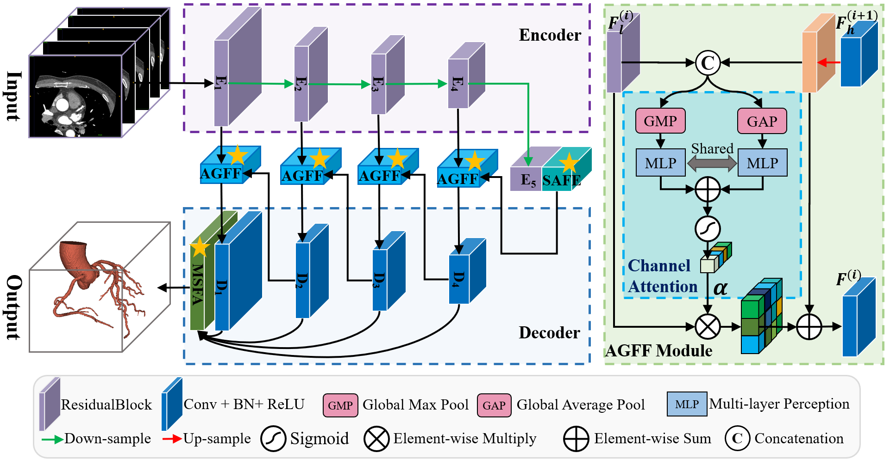

# CAS-Net
This is the official PyTorch implementation for our paper, "A novel multi-attention, multi-scale 3D deep network for coronary artery segmentation", published in the journal 
*Medical Image Analysis* (2023).
[](https://doi.org/10.1016/j.media.2023.102745)
[](https://opensource.org/licenses/MIT)

## Introduction

CAS-Net is a novel deep learning network for the 3D segmentation of the coronary arteries. By introducing three core attention modules, our model aims to efficiently and accurately segment complex vascular structures from Coronary CT Angiography (CCTA) images.

  * **AGFF (Attention-Gated Feature Fusion)**
  * **MSFA (Multi-Scale Feature Attention)**
  * **SAFE (Scale-Aware Feature Enhancement)**



## Environment Setup

1.  Clone this repository:

    ```bash
    git clone https://github.com/Cassie-CV/CAS-Net.git
    cd CAS-Net
    ```

2.  We recommend using `conda` to create a virtual environment:

    ```bash
    conda create -n casnet python=3.8
    conda activate casnet
    ```

3.  Install the required dependencies (we recommend creating a `requirements.txt` file based on your environment):

    ```bash
    # Example dependencies, please modify according to your project
    pip install torch torchvision torchaudio --index-url https://download.pytorch.org/whl/cu118
    pip install numpy SimpleITK tqdm scikit-learn
    ```

## Data Preparation

As seen in `test.py` or `train.py`, the preprocessed CCTA data should be organized with the following structure:

```
data
└── npy
    ├── img
    │   ├── 1.npy
    │   ├── 2.npy
    │   └── ...
    └── mask
        ├── 1.npy
        ├── 2.npy
        └── ...
```

## Usage

### Training

Use the following command to start training the CAS-Net model. Please modify the parameters according to your setup.

```bash
python train.py 
```

### Inference / Testing

Use the trained model weights to perform inference on the test set.

```bash
python test.py 
```

## Acknowledgements

We would like to extend our special thanks to the authors of **CS²-Net** ([DOI: 10.1016/j.media.2020.101874](https://doi.org/10.1016/j.media.2020.101874)). Their work served as an important basebone for our study, and their public code repository is exceptionally well-structured.

In our project, we have adapted and reused some of their general-purpose utility scripts (such as `utils/evaluation_metrics3D.py`). We are sincerely grateful for their excellent contribution to the open-source community.

## How to Cite

If you use our work or code in your research, please cite our paper:

```bibtex
@article{dong2023novel,
  title={A novel multi-attention, multi-scale 3D deep network for coronary artery segmentation},
  author={Dong, Caixia and Xu, Songhua and Dai, Duwei and Zhang, Yizhi and Zhang, Chunyan and Li, Zongfang},
  journal={Medical Image Analysis},
  volume={85},
  pages={102745},
  year={2023},
  publisher={Elsevier}
}
```

## License

This repository is licensed under the [MIT License](https://www.google.com/search?q=LICENSE).

